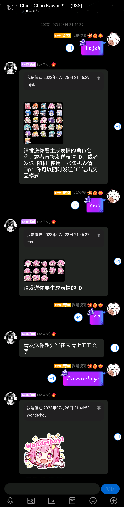
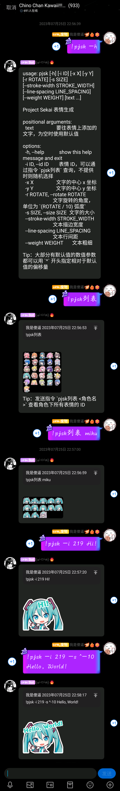

<!-- markdownlint-disable MD026 MD031 MD033 MD036 MD041 -->

<div align="center">

<a href="https://v2.nonebot.dev/store">
  
</a>

<p>
  
</p>

# NoneBot-Plugin-PJSK

_✨ Project Sekai 表情包制作 ✨_


<a href="https://pdm.fming.dev">
  
</a>
<a href="https://jq.qq.com/?_wv=1027&k=l82tMuPG">
  
</a>

<br />

<a href="./LICENSE">
  
</a>
<a href="https://pypi.python.org/pypi/nonebot-plugin-pjsk">
  
</a>
<a href="https://pypi.python.org/pypi/nonebot-plugin-pjsk">
  
</a>

</div>

## 💬 前言

- 如遇字体大小不协调问题，请更新插件到最新版本，并且删除 `data/pjsk/fonts` 文件夹下的所有文件
- 如果遇到资源文件下载失败的情况，请参考 [这个 issue](https://github.com/Agnes4m/nonebot_plugin_pjsk/issues/15)

## 📖 介绍

### Wonderhoy!


## 💿 安装

以下提到的方法 任选**其一** 即可

<details open>
<summary>[推荐] 使用 nb-cli 安装</summary>
在 nonebot2 项目的根目录下打开命令行, 输入以下指令即可安装

```bash
nb plugin install nonebot-plugin-pjsk
```

</details>

<details>
<summary>使用包管理器安装</summary>
在 nonebot2 项目的插件目录下, 打开命令行, 根据你使用的包管理器, 输入相应的安装命令

<details>
<summary>pip</summary>

```bash
pip install nonebot-plugin-pjsk
```

</details>
<details>
<summary>pdm</summary>

```bash
pdm add nonebot-plugin-pjsk
```

</details>
<details>
<summary>poetry</summary>

```bash
poetry add nonebot-plugin-pjsk
```

</details>
<details>
<summary>conda</summary>

```bash
conda install nonebot-plugin-pjsk
```

</details>

打开 nonebot2 项目根目录下的 `pyproject.toml` 文件, 在 `[tool.nonebot]` 部分的 `plugins` 项里追加写入

```toml
[tool.nonebot]
plugins = [
    # ...
    "nonebot_plugin_pjsk"
]
```

</details>

## ⚙️ 配置

插件开箱即用，所有配置项皆为可选。请**按需添加**下面的配置项到 `.env` 文件中

|        配置项        | 必填 | 默认值  |                                                              说明                                                              |
| :------------------: | :--: | :-----: | :----------------------------------------------------------------------------------------------------------------------------: |
| `PJSK_ASSETS_PREFIX` |  否  |   ...   |                          TheOriginalAyaka/sekai-stickers 仓库 GitHubUserContent 地址，默认为国内镜像                           |
|  `PJSK_REPO_PREFIX`  |  否  |   ...   |                                         本仓库 GitHubUserContent 地址，默认为国内镜像                                          |
| `PJSK_EMOJI_SOURCE`  |  否  | `Apple` | Emoji 来源，可选值见 [这里](https://github.com/nathanielfernandes/imagetext-py/blob/master/imagetext_py/imagetext_py.pyi#L217) |
| `PJSK_HELP_AS_IMAGE` |  否  | `True`  |                                                  是否将帮助信息渲染为图片发送                                                  |
|     `PJSK_REPLY`     |  否  | `True`  |                                                       是否回复消息发送者                                                       |

## 🎉 使用

直接使用指令 `pjsk` 进入交互创建模式；  
使用指令 `pjsk -h` 了解使用 Shell-Like 指令创建表情的帮助

### 效果图

<details>
<summary>使用交互创建模式</summary>



</details>

<details>
<summary>使用 Shell-Like 指令</summary>



</details>

## 🙈 碎碎念

- ~~由于本人没玩过啤酒烧烤，~~ 可能出现一些小问题，可以提 issue 或者 [加群](https://jq.qq.com/?_wv=1027&k=l82tMuPG)反馈 ~~或者单纯进来玩~~
- 本项目仅供学习使用，请勿用于商业用途，喜欢该项目可以 Star 或者提供 PR，如果构成侵权将在 24 小时内删除
- [爱发电](https://afdian.net/a/agnes_digital)

## 💡 鸣谢

### [TheOriginalAyaka/sekai-stickers](https://github.com/TheOriginalAyaka/sekai-stickers)

- 原项目 & 素材来源

## 💰 赞助

感谢大家的赞助！你们的赞助将是我继续创作的动力！

- [爱发电](https://afdian.net/a/agnes_digital)

## 📝 更新日志

### 0.2.8

- 修复无法自定义表情源的 bug

### 0.2.7

- 修复参数为 `0` 时不生效的 Bug
- 现在可以关闭回复消息发送者的特性了
- 命令参数调整：
  - 删除 `--weight` 参数，因为没有实际意义
  - `--rotate` 参数可以接受小数了
  - `--stroke-width` 参数添加简写 `-W`
  - `--line-spacing` 参数添加简写 `-C`

### 0.2.6

- 插件会按角色名重新排序表情列表与表情 ID，以防数据源表情 ID 冲突
- 角色列表名称展示优化

### 0.2.5

- 使用自己合并的字体文件避免某些字不显示的问题

### 0.2.4

- 在交互模式中提供的参数会去掉指令前缀，以防 Adapter 删掉参数开头的 Bot 昵称，导致参数不对的情况
- 重写帮助图片的渲染（个人感觉效果还不是很好……）

### 0.2.3

- 限制了贴纸文本大小，以免 Bot 瞬间爆炸
- 未提供字体大小时适应性调节 ([#14](https://github.com/Agnes4m/nonebot_plugin_pjsk/issues/14))
- 参数 `--rotate` 改为提供角度值，正数为顺时针旋转
- 将指令帮助渲染为图片发送（可以关）
- 丢掉了 `pil-utils` 依赖

### 0.2.2

- 修改了 0.2.1 版的交互创建模式的触发方式
- 试验性地支持了 Emoji

### 0.2.1

- 更改指令 `pjsk列表` 的交互方式

### 0.2.0

- 重构插件
